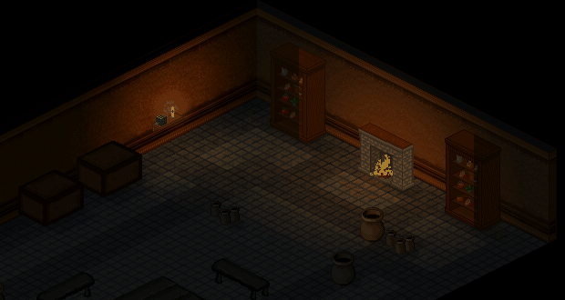
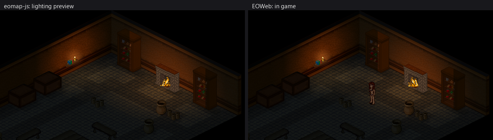
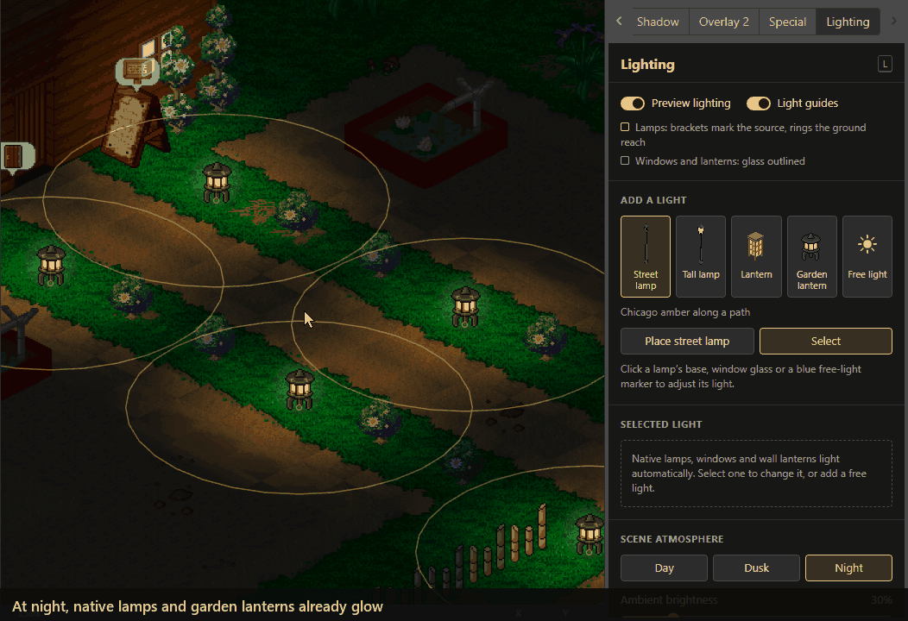
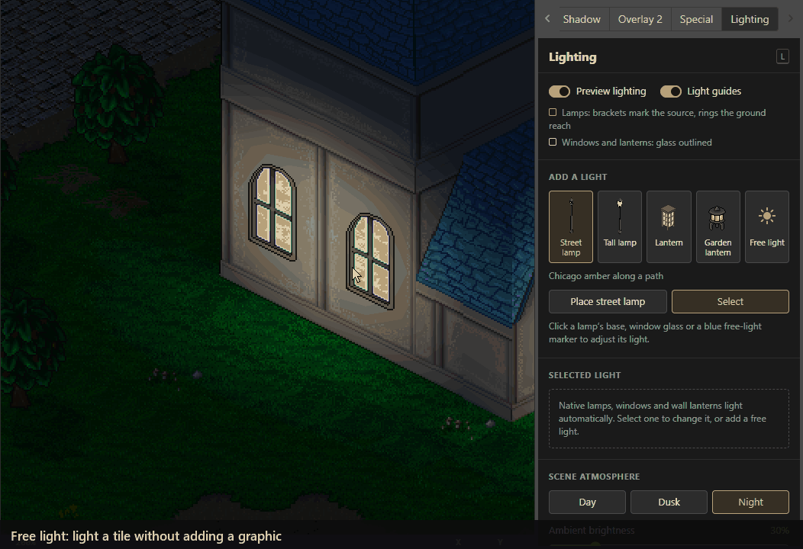
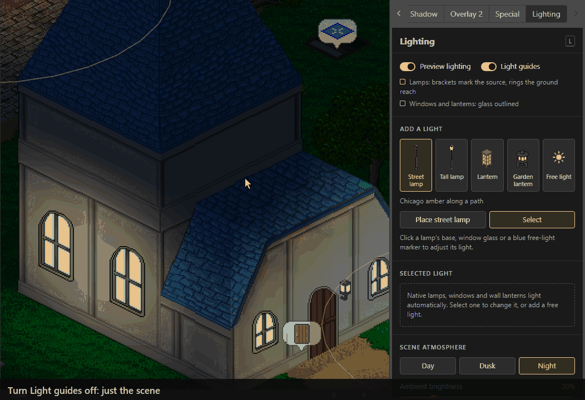
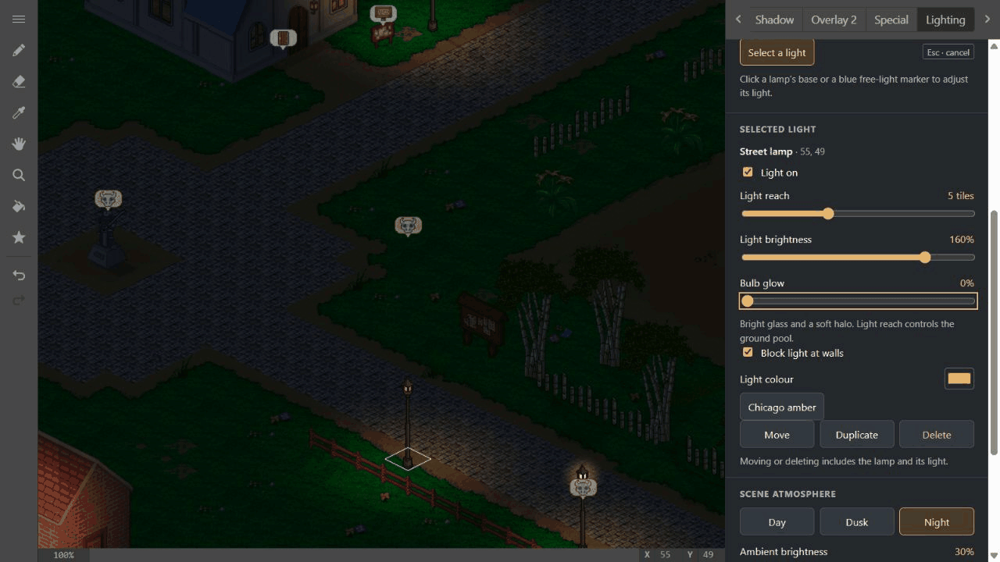
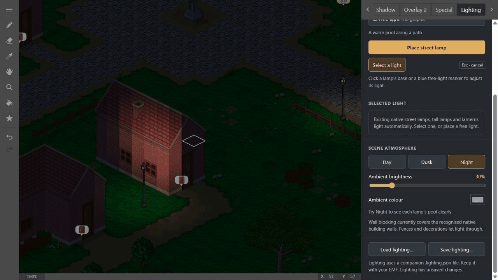
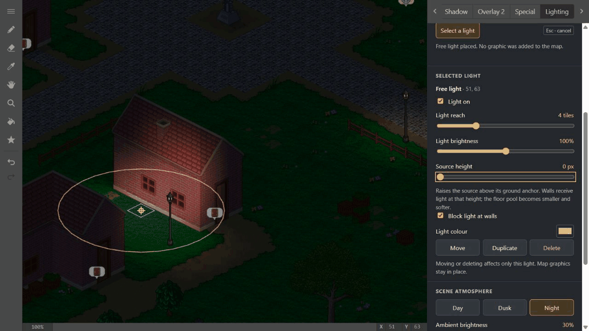
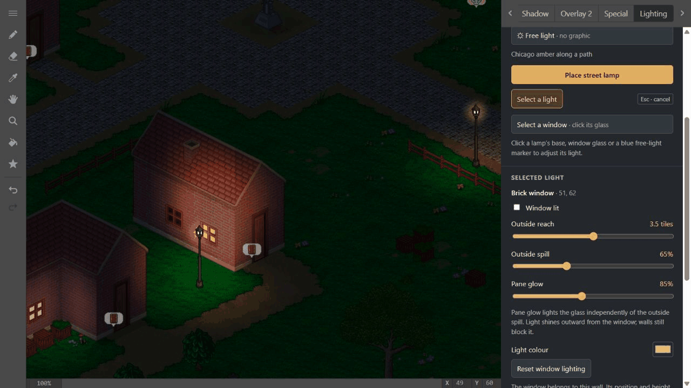

[](https://sonarcloud.io/summary/new_code?id=Cirras_eomap-js)
[](https://github.com/Cirras/eomap-js/actions/workflows/format.yml)
[](https://github.com/Cirras/eomap-js/actions/workflows/build.yml)
[](https://github.com/Cirras/eomap-js/actions/workflows/release.yml)

An Endless Map File (EMF) editor written in JavaScript.

## Lighting

**Lighting** sits beside **Special** in the layer palette (shortcut **L**). While it's selected, native lamps and windows light up on their own: street, tall and festive lamps, lanterns and garden lanterns; candlesticks; shelf, bedside, desk, cabinet and shrine candles; a blue brazier; the fireplace; 30 window styles and the church's wall lantern. Candles, the brazier and the fireplace burn with moving flames. Every other tool shows the map as the game draws it.

You can add lamps or free lights, tune any light, and save the result to a companion `.lighting.json` file beside the map. The EMF itself never changes, so servers and clients that know nothing about lighting keep working with it.



The same file lights the map in game. [EOWeb](https://github.com/tabbyed/eoweb) loads it beside each map and draws it with this editor's lighting core, so a room looks the same in both:



### How to use it

**Place and tune a light.** Click a lamp's base to select an existing one. To add one, choose a light, move over the map to preview it live, then click an empty tile. Tune its reach, brightness, glow and colour. Every edit is undoable.



**Lights and walls.** A **Free light** lights any tile without adding a graphic. Outside a building, the wall face catches the light. Once the source is inside, the wall keeps the light in. **Source height** lifts the lit patch up the wall, and **Block light at walls** lets one light ignore walls.



**Windows and wall lanterns.** Choose **Select** and click the glass. Either half of a window split across two wall pieces selects the same window. **Pane glow** lights the glass and **Outside spill** the ground outside; a lantern has the same controls under lantern names. **Light guides** outlines every recognised window and shows each lamp's reach, with the selected light drawn at full strength.



**Scene atmosphere** sets Day, Dusk or Night ambient light. **Load lighting…** and **Save lighting…** read and write the companion file. If the map has changed since the lighting was saved, loading keeps every light that still matches and tells you how many it skipped. Saving the map also saves its lighting. If the lighting has no file yet you're asked for one; cancel, and the map is still saved while the lighting stays unsaved until you choose a file.

### How it works

- **A cached light field.** Every light adds its colour into a grid holding one value per tile at 19 heights, 32 px apart. Shading samples that grid instead of looping over lights, and changing one light recomputes only the tiles it reaches.
- **Walls are edges, not tiles.** A Down wall lies on the edge between its tile and the next row (`y + ½`); a Right wall on the edge to the next column (`x + ½`). Light can reach one side of a wall without entering the other, so a street can be lit while the room behind stays dark.
- **Walls block light by ray casting.** Each light has 512 ray directions across that grid of edges and casts only the rays its tiles look up. A ray stops at the first recognised solid wall, checking both edges at corners so light cannot slip through diagonally. Only curated native building walls block; fences and decorations let light through.
- **Walls are lit as one surface.** Each wall sprite is shaded in horizontal strips that sample the field on the wall's outside face at their real height. A raised light lights the wall higher up, and neighbouring wall pieces meet without seams.
- **Wall edits update live.** Adding, removing or replacing a wall re-traces only the lights whose reach touches it.
- **Windows and lanterns are part of the wall art.** Their glass is picked out by exact colours inside a small box, so frames and bricks never glow. Each shines outward from its face only, and its wall still blocks light.
- **Flames are animated from the game's own art.** Candles, the brazier and the fireplace swap their still flames for moving ones, all stepping on one flicker clock with uneven 120–190 ms steps so they never look mechanical. A fixture built from two graphics, like the fireplace, is one light drawn across both.

Roof surfaces, finite-height blockers and custom graphics still need explicit geometry metadata. Preview shading requires WebGL. For where the code lives, see [Lighting](docs/LIGHTING.md); for how we got here, [Some thoughts on lighting](docs/some-thoughts-on-lighting.md).

<details>
<summary>More examples</summary>

A lamp's **Bulb glow** switches off and on while its amber ground pool stays lit:



Per-piece wall shading compared with continuous surface shading on the same building:



Raising a free source from 0 to 128 pixels leaves its ground anchor fixed:



One window switches off and on while its neighbour and a street lamp stay lit:



</details>

### In game clients

The lighting core lives in [`src/core/lighting`](src/core/lighting) as **eo-lighting**, a package with no renderer of its own. It holds the lamp and window catalogue, the light field, the lighting file, and what each graphic should show. The editor draws it with Phaser. A game client installs it straight from this repository and draws the same numbers its own way:

```sh
pnpm add "github:tabbyed/eomap-js#<commit>&path:/src/core/lighting"
```

EOWeb does exactly this: it reads `public/maps/NNNNN.lighting.json`, the file this editor saves, and lights the map with Pixi. See the [package README](src/core/lighting/README.md) for the API.

### Try it

To preview with your own native graphics and an optional local map:

```sh
npm ci
node scripts/lighting-dev-server.cjs /path/to/gfx /path/to/map.emf
```

Open `http://127.0.0.1:4174/` and choose **Open lighting preview**. The helper serves your supplied graphics locally; it does not bundle them into this repository. Without the optional map argument, use the normal map-open flow.

Run the lighting checks with `npm run test:lighting` and CPU benchmarks with `npm run benchmark:lighting`. `node scripts/audit-window-assets.cjs --gfx /path/to/gfx --maps /path/to/maps` verifies the window catalogue against your graphics and maps.

## Requirements

[Node.js](https://nodejs.org) is required to install dependencies and run scripts via `npm`.

## Available Commands

| Command                  | Description                                     |
| ------------------------ | ----------------------------------------------- |
| `npm install`            | Install project dependencies                    |
| `npm start`              | Build electron and open application             |
| `npm run start:web`      | Build web and open web server running project   |
| `npm run start:electron` | Build electron and open application             |
| `npm run dist`           | Build web and electron with production settings |
| `npm run dist:web`       | Build web with production settings              |
| `npm run dist:electron`  | Build electron with production settings         |
| `npm run format`         | Format changed files using Prettier             |

## Writing Code

After cloning the repo, run `npm install` from your project directory. Then, you can start the application by running `npm start`.

After starting the application with `npm start`, webpack will automatically recompile and reload the application when source files change.

## Deploying to Web

After you run the `npm run dist:web` command, the project will be built into `dist/web`.

If you put the contents of the `dist/web` folder in a publicly-accessible location (say something like `https://example.com`), you should be able to open `https://example.com/index.html` and use the application.

Configure your web server to use [ETags](https://en.wikipedia.org/wiki/HTTP_ETag) for cache validation.

## Connected Mode

In the application settings, you will find a section called `Connected Mode`.
When Connected Mode is enabled, graphics will be loaded from the remote Mapper Service specified by the `Mapper Service URL` setting.

### Hosting a Mapper Service

Currently, the steps for creating your own Mapper Service are:

- Set up a web server
- Configure your web server to use [ETags](https://en.wikipedia.org/wiki/HTTP_ETag) for cache validation.
- Configure your web server for CORS
  - Return the response header `Access-Control-Allow-Origin: *`
  - See: [Cross-Origin Resource Sharing](https://developer.mozilla.org/en-US/docs/Web/HTTP/CORS)
  - See: [Access-Control-Allow-Origin](https://developer.mozilla.org/en-US/docs/Web/HTTP/Headers/Access-Control-Allow-Origin)
- Serve EGF files from `/gfx`
- Serve Mapper Assets from `/assets`
  - Copy the bundled assets out from `src/assets/bundled`

### Forced Connected Mode

If you're hosting an instance of eomap-js and want to lock it to a particular remote Mapper Service, then you can use the `FORCE_CONNECTED_MODE_URL` environment variable.

When `FORCE_CONNECTED_MODE_URL` is defined, Connected Mode will be forcibly enabled and the `Mapper Service URL` will be locked to the specified URL.

Usage examples:

- `npm run start:web -- --env FORCE_CONNECTED_MODE_URL="https://example.com"`
- `npm run dist:web -- --env FORCE_CONNECTED_MODE_URL="https://example.com"`
